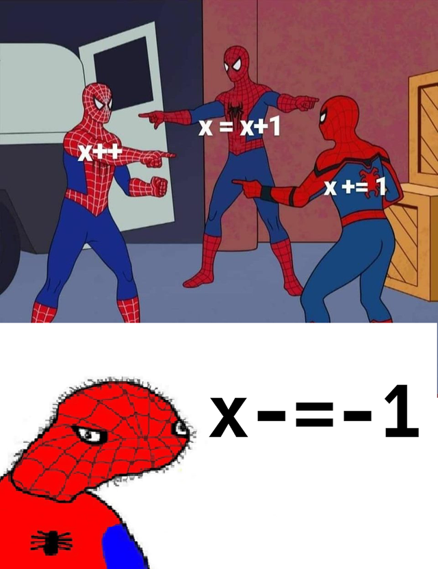

# Tutorial 3 Notes

1. This week's content is kind of hard to convert into a Kahoot so this week's Kahoot will be some quick revision.

<details>
  <summary>Link</summary>

https://play.kahoot.it/v2/?quizId=47f01a7a-b481-4407-a286-1578803b02e2
</details>

<br>

2. Let's talk about the rules of the C language and style rules.

    1. Variable names must start with either a letter or an underscore.

    2. Variable names must be shorter than 8 characters.
  
    3. Variable names can contain numbers, as long as they aren't the first character.
  
    4. Variable names must be lowercase, with words separated by underscores.
  
    5. The names of #defines must be in uppercase.
  
    6. Variable names must start with a letter.
  
    7. Variable names that contain vowels must be avoided.
  
    8. Variable names must be relevant and descriptive.

<details>
  <summary>Answer</summary>

1 and 3 are C language rules.

4, 5, 6 and 8 are style rules.

Overall, the only rule you need to know is that variable names must be relevant and descriptive.
</details>

<br>

3. What is a while loop? What do we need for a while loop?

<details>
  <summary>Answer</summary>

A while loop is a control structure just like if statements but keeps running the code until the condition is false.

To use a while loop, we need to initialise the variables inside our condition, a proper condition and something to move the condition along.
</details>

<br>



4. What are the errors in the following while loops?

```c
int i;

while (i < 100) {
    printf("%d\n", i);
    i = i + 1;
}
```

<details>
    <summary>Answer</summary>

i is not initialised and so it will throw a compiler error. 
    
When we think about this code, if i's value is unknown and unclear, how could (i < 100) possibly work?
</details>

<br>

```c
int i = 0;
int j = 0;

while (j = 1 || i < 100) {
    printf("%d\n", i);
    i = i + 1;
}
```

<details>
    <summary>Answer</summary>

In the while condition, (j = 1) is an assignment, not a condition. DCC will warn you about this and tell you that you probably want (j == 1).

**Bonus**. Last week, we learnt if conditions result into 1s and 0s. While conditions are the same and if an assignment (such as (j = 1)) is successful, it will return 1. Hence, this is an infinite loop.
</details>

<br>

```c
int i = 0;
int n = 10;
while (i < n) {
    printf("%d\n", i);
    n = n + i;
    i = i + 1;
}
```

<details>
    <summary>Answer</summary>

This is an infinite loop because i grows faster than n, and so, the while condition will never be false.
</details>

<br>

```c
int i = 0;
while (i < 10)
    printf("%d\n", i);
    i = i + 1;
```

<details>
    <summary>Answer</summary>

Since there are no curly braces, the while condition only affects the line of code right after it. Hence, the output will be an infinite amount of 0s.
</details>

